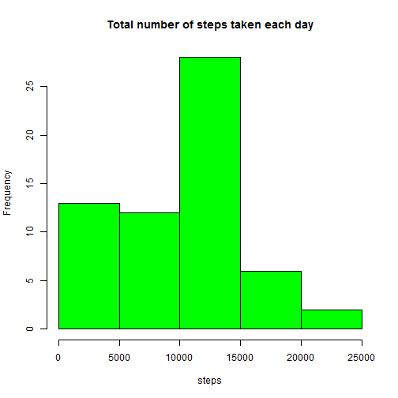
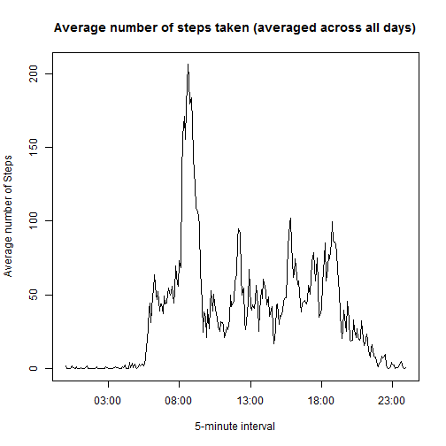
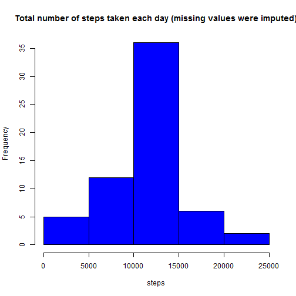
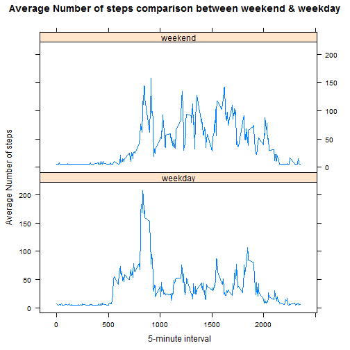

## Loading and preprocessing the data

1: Load the data (i.e. read.csv())

2: Process/transform the data (if necessary) into a format suitable for your analysis

```r
library(knitr)
library(dplyr)
```

```
## Warning: package 'dplyr' was built under R version 3.1.3
```

```
## 
## Attaching package: 'dplyr'
## 
## The following object is masked from 'package:stats':
## 
##     filter
## 
## The following objects are masked from 'package:base':
## 
##     intersect, setdiff, setequal, union
```

```r
setwd("C:/ko/coursea/DataScience/Reproducible Research/PA1")
LoadData <- read.csv("activity.csv")
```
## What is mean total number of steps taken per day?

For this part of the assignment, you can ignore the missing values in the dataset.

1: Calculate the total number of steps taken per day

```r
steps.day <-
LoadData %>%
    group_by(date) %>%
    summarize(total_steps = sum(steps,na.rm=T))
```

2: Make a histogram of the total number of steps taken each day

```r
hist(steps.day$total_steps,xlab="steps",main="Total number of steps taken each day",col = "green")
```

 

3: Calculate and report the mean and median of the total number of steps taken per day

```r
total_mean <- mean(steps.day$total_steps)
total_median <- median(steps.day$total_steps)
```
- Mean of the total number of steps taken per day is 9354.2295082. 
- Median of the total number of steps taken per day is 10395.

## What is the average daily activity pattern?

1: Make a time series plot (i.e. type = "l") of the 5-minute interval (x-axis) and the average number of steps taken, averaged across all days (y-axis)


```r
avg.steps <-
    LoadData %>%
        group_by(interval) %>%
        summarize(average_steps = mean(steps,na.rm=T))
x <- as.character(avg.steps$interval)
x2 <- x
for(i in seq_along(x)){
    if(nchar(x[i])==1){x2[i] <- paste0("000",x[i])}
    else if(nchar(x[i])==2){x2[i] <- paste0("00",x[i])} 
    else if(nchar(x[i])==3){x2[i] <- paste0("0",x[i])} 
    }
x2 <- strptime(x2,format = "%H%M")  
plot(x2,avg.steps$average_steps,type = "l",
     xlab = "Time",ylab = "Average number of Steps", 
     main = "Average number of steps (averaged across all days)")
```

 

2: Which 5-minute interval, on average across all the days in the dataset, contains the maximum number of steps?

```r
max_steps <- max(avg.steps$average_steps)
peek <- which(avg.steps$average_steps == max_steps)
peek_interval <- x[peek]
peek_HHMM <- paste0(x2$hour[peek],":",x2$min[peek])
```
- 5-minute interval - 835 (8:35) - contains the maximum number of steps.

## Imputing missing values  

Note that there are a number of days/intervals where there are missing values (coded as NA). 
The presence of missing days may introduce bias into some calculations or summaries of the data.

1: Calculate and report the total number of missing values in the dataset (i.e. the total number of rows with NAs)


```r
row.location.NAS <- !complete.cases(LoadData)
row.count.NAS <- sum(row.location.NAS)
```
- "Total number of missing values in the dataset" is 2304

2: Devise a strategy for filling in all of the missing values in the dataset. The strategy does not need to be sophisticated. For example, you could use the mean/median for that day, or the mean for that 5-minute interval, etc.


```r
mean.steps <- as.integer(mean(LoadData$steps,na.rm = T))
```
- My Strategy : 
    1. calculate mean of all valid (Non NA) steps  and get the integer of it.  This is 37.
    2. Use this value for the missing value.

3: Create a new dataset that is equal to the original dataset but with the missing data filled in.

```r
NewData <- LoadData
NewData$steps[row.location.NAS] <- mean.steps
```

4: Make a histogram of the total number of steps taken each day and Calculate and report the mean and median total number of steps taken per day. Do these values differ from the estimates from the first part of the assignment? What is the impact of imputing missing data on the estimates of the total daily number of steps?

```r
new.steps.day <-
    NewData %>%
    group_by(date) %>%
    summarize(total_steps = sum(steps,na.rm=T))
hist(new.steps.day$total_steps,xlab="steps",main="Total number of steps taken each day",col="blue")
```

 

```r
new.total_steps.mean <- mean(new.steps.day$total_steps)
new.total_steps.median <- median(new.steps.day$total_steps)
mean_differ <- new.total_steps.mean - total_mean
median_differ <- new.total_steps.median - total_median
mean_pct <- new.total_steps.mean/total_mean*100 
median_pct <- new.total_steps.median/total_median*100
```

- Report the mean and median total number of steps taken per day.
    - Mean   = 1.0751738 &times; 10<sup>4</sup>
    - Median = 10656

- Do these values differ from the estimates from the first part of the assignment?
    - Yes, these values differ from the estimation as below.
        - Mean   differ from 1st part (9354.2295082) =  1397.5081967
        - Median differ from 1st part (10395) =  261  

- What is the impact of imputing missing data on the estimates of the total daily number of steps?
    - Mean & Median of "Imputing missing data" are changed from first part with following percent. 
      I think there is some impact by "Imputing missing data".
        - Mean   differ % from 1st part  =  115[%]
        - Median differ % from 1st part  =  103[%] 
        
## Are there differences in activity patterns between weekdays and weekends?        

For this part the weekdays() function may be of some help here. Use the dataset with the filled-in missing values for this part.

```r
Sys.setlocale("LC_TIME","C") # Need this command for handling date & time function at some non English operating system.
```

```
## [1] "C"
```

```r
NewData$date <- strptime(NewData$date, format = "%Y-%m-%d")
NewData$weekdays <- weekdays(NewData$date)
```
1: Create a new factor variable in the dataset with two levels."weekday" and "weekend" indicating whether a given date is a weekday or weekend day.


```r
SatSun <- (NewData$weekdays == "Saturday")|(NewData$weekdays == "Sunday")
NewData$weekend <- ifelse(SatSun,"weekend","weekday")
NewData$weekend <- as.factor(NewData$weekend)
```

2: Make a panel plot containing a time series plot (i.e. type = "l") of the 5-minute interval (x-axis) and the average number of steps taken, averaged across all weekday days or weekend days (y-axis). See the README file in the GitHub repository to see an example of what this plot should look like using simulated data.


```r
library(lattice)
```

```
## Warning: package 'lattice' was built under R version 3.1.3
```

```r
compare.steps <- 
    NewData[-2] %>%                         # drop date column
    group_by(interval,weekend) %>%
    summarize(average_steps = mean(steps,na.rm=T))
xyplot(average_steps ~ as.integer(interval) | weekend, data=compare.steps
       ,layout=c(1,2), type = 'l', xlab = "Interval", ylab = "Number of steps",
       main = "Number of steps comparison between weekend & weekday")
```

 
